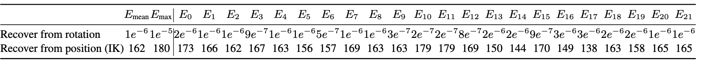

# Processing scripts of 272-dim Motion Representation

<p align="center">
  
</p>

> 🔄 Left: Our Representation; Right: IK failure.
> 
> We refine the motion representation to enable directly conversion from joint rotations to SMPL body parameters, removing the need of Inverse Kinematics (IK) operation.


## 📮 Change Log
📢  **2025-04-04** --- Release the processed 272-dim Motion Representation of [HumanML3D](https://github.com/EricGuo5513/HumanML3D) dataset. Only for academic usage.

📢  **2025-03-28** --- Release the evaluation code and the Quantitative comparison results of recovery from joint rotations and joint positions respectively.

📢  **2025-03-13** --- Release the processing scripts to obtain the modified 272-dim motion representation and the Qualitative results of recovery from joint rotations and joint positions respectively.


## 🚀 Getting Started

### 🐍 Python Virtual Environment
```sh
conda env create -f environment.yaml
conda activate mgpt
```

## 📥 Data Preparation

<details>
<summary><b> ⬇️ Download AMASS data</b></summary>

- For **HumanML3D**, **BABEL**, and **KIT-ML** dataset usage:
  - Download all "SMPL-H G" motions from the [AMASS website](https://amass.is.tue.mpg.de/download.php)
  - Place them in `datasets/amass_data`
- For **Motion-X** usage:
  - Download all `SMPL-X G`
  - Place them in `datasets/amass_data_smplx`
</details>

<details>
<summary><b>🤖 Download SMPL+H and DMPL model</b></summary>

1. Download [SMPL+H](https://mano.is.tue.mpg.de/download.php) (Extended SMPL+H model used in AMASS project)
2. Download [DMPL](https://smpl.is.tue.mpg.de/download.php) (DMPLs compatible with SMPL)
3. Place all models under `./body_model/`
</details>

<details>
<summary><b>👤 Download human model files</b></summary>

1. Download files from [Google Drive](https://drive.google.com/file/d/1y5jthVfCcMkT4cPNlyctH_AMDNz48e43/view?usp=sharing)
2. Place under `./body_model/`
</details>

<details>
<summary><b>⚙️ Process AMASS data</b></summary>

```python
python amass_process.py --index_path ./test_t2m.csv --save_dir ./output/smpl_85
```
</details>

<details>
<summary><b>📝 Generate mapping files and text files</b></summary>

- Follow [UniMoCap](https://github.com/LinghaoChan/UniMoCap/tree/main?tab=readme-ov-file#2-generate-mapping-files-and-text-files) Step2 to get:
  1. Mapping files (.csv)
  2. Text files (./{dataset}_new_text)

  (Note: Remember to set fps=30 in the [h3d_to_h3d.py](https://github.com/LinghaoChan/UniMoCap/blob/main/h3d_to_h3d.py) file.)
</details>

## 🏃 Quick Start Guide

### 1. Transform SMPL to Z+ direction
```python
python face_z_transform.py --filedir ./output
```

### 2. Get global joint positions through SMPL layer
```python
python infer_get_joints.py --filedir ./output
```

### 3. Generate 272-dimensional motion representation
```python
python representation_272.py --filedir ./output
```

### 4. Calculate Mean and Std (Optional)
> We provide 272-dimentional Mean.npy and Std.npy of HumanML3D dataset under folder "mean_std/".
```python
python cal_mean_std.py --input_dir ./output/Representation_272 --output_dir ./mean_std
```

### 5. Visualize representation (Optional)
> Recover from rotation:
```python
python recover_visualize.py --mode rot --input_dir ./output/Representation_272 --output_dir ./visualize_result
```
> Recover from position:
```python
python recover_visualize.py --mode pos --input_dir ./output/Representation_272 --output_dir ./visualize_result
```


### 6. Representation_272 to BVH conversion (Optional)
```python
python representation_272_to_bvh.py --gender NEUTRAL --poses ./output/Representation_272 --output ./output/Representation_272 --fps 30 --is_folder
```

## 📖 Evaluation (Optional)
To make our 272-dim motion representation more persuasive, we provide Quantitative comparison results.
Our goal is to obtain SMPL rotations for further usage (e.g. convert to BVH), so we evaluate the following 2 ways (Directly vs. IK) to recover SMPL rotations.<br>
> We provide Quantitative comparison between the SMPL rotations recovered from: 
> <br>(1) joint rotations ([8+6\*22 : 8+12\*22] in our 272 representaion. Directly recover, No need IK).
> <br>(2) joint positions ([8 : 8+3\*22] in our 272 representaion, Need IK: position -> rotation). 
> <br>We refer to [MoMask](https://github.com/EricGuo5513/momask-codes/blob/main/visualization/joints2bvh.py) for the IK implementation.

> We use angle error (geodesic distance) between the GT SMPL rotations and the recovered rotations (minimum angle between rotations) as the metric.
> <br>GT: The data (85-dim) after running Step 1 in the [Quick Start Guide](https://github.com/Li-xingXiao/272-dim-Motion-Representation/tree/master?tab=readme-ov-file#-quick-start-guide) is used as GT ([ :22\*3] denotes SMPL rotations).

>We evaluate: 
> <br>(1) Average and Max joint errors across all files (marked as E<sub>mean</sub> and E<sub>max</sub>).
> <br>(2) Average joint errors across all files (marked as E<sub>0</sub>, E<sub>1</sub>,..., E<sub>21</sub>).
> <br>Evaluation is down on the [HumanML3D](https://github.com/EricGuo5513/HumanML3D) dataset (processed by our scripts).

Evaluation of recovery from rotation (Directly, No need IK):
```python
python cal_angle_error.py --mode rot
```
Evaluation of recovery from position (Need IK: position -> rotation):
```python
python cal_angle_error.py --mode pos
```
## 📍 Evaluation Results

🔥🔥🔥 The errors of Directly recovery from joint rotations (No Need IK) is significantly <strong>lower</strong> than those of recovery from joint positions (Need IK: position -> rotation)!

## 🎬 Visualization Results

<p align="center">
  
  
</p>
<p align="center">
  <em>Left: Recover from rotation &nbsp;&nbsp;&nbsp;&nbsp; Right: Recover from position</em>
</p>

## 🤗 Processed 272-dim Motion Representation of HumanML3D dataset</b></summary>
To facilitate researchers, we provide the processed 272-dim Motion Representation of:
> HumanML3D dataset at [this link](https://huggingface.co/datasets/lxxiao/272-dim-HumanML3D).

> BABEL dataset at [this link](https://huggingface.co/datasets/lxxiao/272-dim-BABEL).

❗️❗️❗️ The processed data is solely for academic purposes. Make sure you read through the [AMASS License](https://amass.is.tue.mpg.de/license.html).

1. Download the processed 272-dim [HumanML3D](https://github.com/EricGuo5513/HumanML3D) dataset following:
```bash
huggingface-cli download --repo-type dataset --resume-download lxxiao/272-dim-HumanML3D --local-dir ./humanml3d_272
cd ./humanml3d_272
unzip texts.zip
unzip motion_data.zip
```
The dataset is organized as:
```
./humanml3d_272
  ├── mean_std
      ├── Mean.npy
      ├── Std.npy
  ├── split
      ├── train.txt
      ├── val.txt
      ├── test.txt
  ├── texts
      ├── 000000.txt
      ...
  ├── motion_data
      ├── 000000.npy
      ...
```

2. Download the processed 272-dim [BABEL](https://babel.is.tue.mpg.de/) dataset following:
```bash
huggingface-cli download --repo-type dataset --resume-download lxxiao/272-dim-BABEL --local-dir ./babel_272
cd ./babel_272
unzip texts.zip
unzip motion_data.zip
```
The dataset is organized as:
```
./babel_272
  ├── t2m_babel_mean_std
      ├── Mean.npy
      ├── Std.npy
  ├── split
      ├── train.txt
      ├── val.txt
  ├── texts
      ├── 000000.txt
      ...
  ├── motion_data
      ├── 000000.npy
      ...
```

## 🌹 Acknowledgement
This repository builds upon the following awesome datasets and projects:
- [AMASS](https://amass.is.tue.mpg.de/index.html)
- [HumanML3D](https://github.com/EricGuo5513/HumanML3D)
- [UniMoCap](https://github.com/LinghaoChan/UniMoCap/tree/main)
- [SMPL2BVH](https://github.com/KosukeFukazawa/smpl2bvh)

## 📚 License
This codebase is released under the [MIT License](LICENSE).  
Please note that it also relies on external libraries and datasets, each of which may be subject to their own licenses and terms of use.

## 🤝🏼 Citation
The following exciting works use the 272-dim motion representation in this repo.

If our project is helpful for your research, please consider citing :

ICCV 2025:
``` 
@article{xiao2025motionstreamer,
      title={MotionStreamer: Streaming Motion Generation via Diffusion-based Autoregressive Model in Causal Latent Space},
      author={Xiao, Lixing and Lu, Shunlin and Pi, Huaijin and Fan, Ke and Pan, Liang and Zhou, Yueer and Feng, Ziyong and Zhou, Xiaowei and Peng, Sida and Wang, Jingbo},
      journal={arXiv preprint arXiv:2503.15451},
      year={2025}
    }
```

ICCV 2025 HighLight:
```
@article{fan2025go,
  title={Go to Zero: Towards Zero-shot Motion Generation with Million-scale Data},
  author={Fan, Ke and Lu, Shunlin and Dai, Minyue and Yu, Runyi and Xiao, Lixing and Dou, Zhiyang and Dong, Junting and Ma, Lizhuang and Wang, Jingbo},
  journal={arXiv preprint arXiv:2507.07095},
  year={2025}
}
```

## Star History

[](https://www.star-history.com/#Li-xingXiao/272-dim-Motion-Representation&Date)
